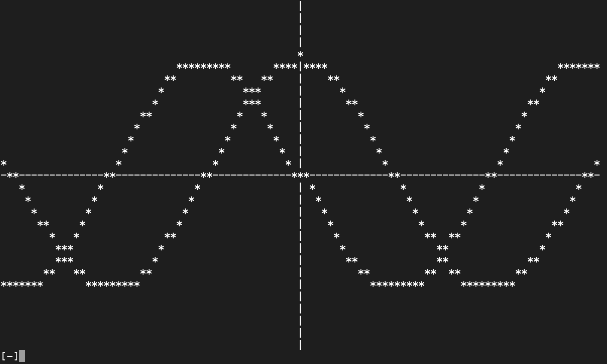

# Command Line Graphing Calculator

### How to Graph:
Use `python3 graph` in the directory with `graph.py` to open the interface. When prompted, enter a function of the form
- `mx + b` (like 0.5x + 2)
- `asin(bx) + c` (like 10sin(0.1x) - 3)
- `acos(bx) + c` (like cos(10x) + 1). \
Note that for now, the window is stuck at 30x100 (*-50 < x < 50*, *-15 < y < 15*) with an interval of 1 in both axis directions. You can run through an animation of these functions changing variables by typing `go <linear|sin|cos>`. \
Exit the program via typing `exit`.
### Todo
- [ ] support for exponentials, polynomials, and tangent
- [ ] make parsing an actual parsing tree instead of the omega cursed mess it is rn
- [ ] allow for change in window, interval, and axes
- [ ] let `go` allow for more variables to change
